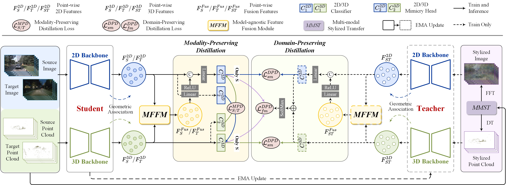

# **Fusion-then-Distillation: Toward Cross-modal Positive Distillation for Domain Adaptive 3D Semantic Segmentation **

:fire: This is the official PyTorch implementation of our work. :fire:

## Overview


## News
* **2024-09-10** :rocket: We release the code for FtD-PlusPlus. It's an extended version of [BFtD]((https://doi.org/10.1145/3581783.3612013). 
* **2024-07-21** :loudspeaker: Our work, [CLIP2UDA](https://openreview.net/pdf?id=Ai1ziPxtmr), has been accepted by ACM MM 2024. (https://github.com/Barcaaaa/CLIP2UDA)

## Getting Started

### Installation

The implementation runs on
- Python 3.8
- Torch 1.9.0
- Torchvision 0.10.0
- CUDA 11.1
- [SparseConvNet](https://github.com/facebookresearch/SparseConvNet)
- [nuscenes-devkit](https://github.com/nutonomy/nuscenes-devkit)

### Preparation
As 3D network we use SparseConvNet. We advise to create a new conda environment for installation. PyTorch and CUDA can be installed, and SparseConvNet installed/compiled as follows:
```
pip install --upgrade git+https://github.com/facebookresearch/SparseConvNet.git
```

### Dataset (Refer to [xMUDA_journal](https://github.com/valeoai/xmuda_journal))
You need to perform preprocessing to generate the data for FtD-PlusPlus.

NuScenes:
- Please download the Full dataset (v1.0) from the [NuScenes website](https://www.nuscenes.org/) and extract it.
- Please edit the script xmuda/data/nuscenes/preprocess.py as follows and then run it.
  - ```root_dir``` should point to the root directory of the NuScenes dataset.
  - ```out_dir``` should point to the desired output directory to store the pickle files.

A2D2:
- Please download the Semantic Segmentation dataset and Sensor Configuration from the [Audi website](https://www.a2d2.audi/a2d2/en/download.html) or directly use ```wget``` and the following links, then extract.
- Please edit the script xmuda/data/a2d2/preprocess.py as follows and then run it.
  - ```root_dir``` should point to the root directory of the A2D2 dataset.
  - ```out_dir``` should point to the desired output directory to store the undistorted images and pickle files. It should be set differently than the ```root_dir``` to prevent overwriting of images.

SemanticKITTI:
- Please download the files from the [SemanticKITTI website](http://semantic-kitti.org/dataset.html) and additionally the [color data](http://www.cvlibs.net/download.php?file=data_odometry_color.zip) from the [Kitti Odometry website](https://www.cvlibs.net/datasets/kitti/eval_odometry.php). Extract everything into the same folder. Similar to NuScenes preprocessing, we save all points that project into the front camera image as well as the segmentation labels to a pickle file.
- Please edit the script xmuda/data/semantic_kitti/preprocess.py as follows and then run it.
  - ```root_dir``` should point to the root directory of the SemanticKITTI dataset.
  - ```out_dir``` should point to the desired output directory to store the pickle files.

VirtualKITTI:
- Clone the repo from [VirtualKITTI website](https://github.com/VisualComputingInstitute/vkitti3D-dataset.git).
- Download raw data and extract with following script.
  ```
  cd vkitti3D-dataset/tools
  mkdir path/to/virtual_kitti
  bash download_raw_vkitti.sh path/to/virtual_kitti
  ```
- Generate point clouds (npy files).
  ```
  cd vkitti3D-dataset/tools
  for i in 0001 0002 0006 0018 0020; do python create_npy.py --root_path path/to/virtual_kitti --out_path path/to/virtual_kitti/vkitti_npy --sequence $i; done
  ```
- Similar to NuScenes preprocessing, we save all points and segmentation labels to a pickle file.
- Please edit the script `xmuda/data/virtual_kitti/preprocess.py` as follows and then run it.
  - `root_dir` should point to the root directory of the VirtualKITTI dataset.
  - `out_dir` should point to the desired output directory to store the pickle files.

## Usage
### Training UDA
```
cd <root dir of this repo>
# day to night
CUDA_VISIBLE_DEVICES=0 python -W ignore xmuda/train_dn_bftd_uni.py --cfg=configs/nuscenes_lidarseg/day_night/uda/bftd.yaml
# usa to singapore
CUDA_VISIBLE_DEVICES=0 python -W ignore xmuda/train_us_bftd_uni.py --cfg=configs/nuscenes_lidarseg/usa_singapore/uda/bftd.yaml
# virtualkitti to semantickitti
CUDA_VISIBLE_DEVICES=0 python -W ignore xmuda/train_vs_bftd_uni.py --cfg=configs/virtual_kitti_semantic_kitti/uda/bftd.yaml
# a2d2 to semantickitti
CUDA_VISIBLE_DEVICES=0 python -W ignore xmuda/train_as_bftd_uni.py --cfg=configs/a2d2_semantic_kitti/uda/bftd.yaml
```
### Training SSDA
```
cd <root dir of this repo>
# usa to singapore
CUDA_VISIBLE_DEVICES=0 python -W ignore xmuda/train_us_bftd_uni_ssda.py --cfg=configs/nuscenes_lidarseg/usa_singapore/ssda/bftd.yaml
# a2d2 to semantickitti
CUDA_VISIBLE_DEVICES=0 python -W ignore xmuda/train_as_bftd_uni_ssda.py --cfg=configs/a2d2_semantic_kitti/ssda/bftd.yaml
```
You can change the path OUTPUT_DIR in the config file `bftd.yaml` and `bftd_pl.yaml`.

### Testing
You can run the testing with:
```
cd <root dir of this repo>
CUDA_VISIBLE_DEVICES=0 python -W ignore xmuda/test.py \
    --cfg=./configs/nuscenes/day_night/uda/bftd.yaml \
    --ckpt2d=./output/day_night/FtD-PlusPlus/best_model_2d.pth \
    --ckpt3d=./output/day_night/FtD-PlusPlus/best_model_3d.pth \
    --fusion=./output/day_night/FtD-PlusPlus/best_model_fusion.pth
```

### Re-training with pseudo-labels
After having trained the FtD-PlusPlus model, generate the offline pseudo-labels as follows:
```
cd <root dir of this repo>
CUDA_VISIBLE_DEVICES=0 python -W ignore xmuda/test.py \
    --cfg=configs/nuscenes/day_night/uda/bftd_pl.yaml \
    --ckpt2d=./output/day_night/FtD-PlusPlus/model_2d_100000.pth \
    --ckpt3d=./output/day_night/FtD-PlusPlus/model_3d_100000.pth \
    --fusion=./output/day_night/FtD-PlusPlus/model_fusion_100000.pth \
    --pselab \
    DATASET_TARGET.TEST "('train_night',)"
```
Note that we use the last model at 100,000 steps to exclude supervision from the validation set by picking the best weights. The pseudo labels and maximum probabilities are saved as ```.npy``` file.

Please edit the ```pselab_paths``` in the config file, e.g. ```configs/nuscenes/day_night/bftd_pl.yaml```, to match your path of the generated pseudo-labels.
Then start the training. The pseudo-label refinement (discard less confident pseudo-labels) is done when the dataloader is initialized.
```
cd <root dir of this repo>
# UDA
CUDA_VISIBLE_DEVICES=0 python -W ignore xmuda/train_dn_bftd_uni.py --cfg=configs/nuscenes_lidarseg/day_night/uda/bftd_pl.yaml
CUDA_VISIBLE_DEVICES=0 python -W ignore xmuda/train_us_bftd_uni.py --cfg=configs/nuscenes_lidarseg/usa_singapore/uda/bftd_pl.yaml
CUDA_VISIBLE_DEVICES=0 python -W ignore xmuda/train_vs_bftd_uni.py --cfg=configs/virtual_kitti_semantic_kitti/uda/bftd_pl.yaml
CUDA_VISIBLE_DEVICES=0 python -W ignore xmuda/train_as_bftd_uni.py --cfg=configs/a2d2_semantic_kitti/uda/bftd_pl.yaml
# SSDA
CUDA_VISIBLE_DEVICES=0 python -W ignore xmuda/train_us_bftd_uni_ssda.py --cfg=configs/nuscenes_lidarseg/usa_singapore/ssda/bftd_pl.yaml
CUDA_VISIBLE_DEVICES=0 python -W ignore xmuda/train_as_bftd_uni_ssda.py --cfg=configs/a2d2_semantic_kitti/ssda/bftd_pl.yaml
```

## Acknowledgements

Code is built based on [xMUDA_journal](https://github.com/valeoai/xmuda_journal) and [BFtD](https://github.com/Barcaaaa/BFtD-xMUDA).

## Citation

If you find this project useful, please consider citing:
```bibtex
@inproceedings{wu2023cross,
  title={Cross-modal Unsupervised Domain Adaptation for 3D Semantic Segmentation via Bidirectional Fusion-then-Distillation},
  author={Wu, Yao and Xing, Mingwei and Zhang, Yachao and Xie, Yuan and Fan, Jianping and Shi, Zhongchao and Qu, Yanyun},
  booktitle={Proceedings of the 31st ACM International Conference on Multimedia},
  pages={490--498},
  year={2023}
}
```